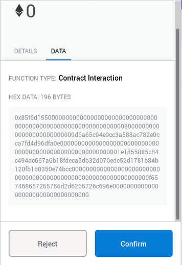

## Closing the Trust Gap (part 1)

Ethereum wallets ask the user before they sign any transaction. This is an important
part of the security and trust framework of Ethereum. The problem is that the more
often you confirm these dialogs, the less inclined you are to actually check the
transaction. Do you know the pesky "TrustedVendor wants to install software on your
computer." dialogs? Exactly.

Furthermore, wallets usually ask you to confirm things like this:

    0xc47f00270000000000000000000000000000000000000000000
    00000000000000000002000000000000000000000000000000000
    00000000000000000000000000000005436872697300000000000
    0000000000000000000000000000000000000000000

Oh yeah, sure, good old 0xc47f! I know exactly what this is doing!

If you are lucky, some wallets might go an extra mile and at least format it a bit more nicely into

    0xc47f0027
    32
    5
    Chris

or even query the so-called "[4 byte directory"](https://www.4byte.directory)" and try to decode the values into

    setName("Chris")

but this only works for very few contracts and very few wallets.

The "4 byte directory" contains a list of all function signatures that match
the so-called "function selector", the first four bytes in the transaction
data that determine which function of the contract you intend to call.
The problem is that they are only four bytes and collisions
(two different functions from different contracts having the same selector)
are not that rare, so you might get the wrong name of the function.
We can do so much better! Especially since the transaction signing was
actually planned to be much more user-friendly from the very beginning.

### Enter Natspec

Natspec, also known as the "Ethereum Natural Language Specification" is a
special way to document functions of smart contracts. Furthermore, it
includes a simple string templating engine, so that the actual function
parameters can be inserted.

As an example, take the following contract:

    contract Name {
        string public name;
        /// Sets the stored name to ${_name}.
        function setName(string memory _name) public {
            name = _name;
        }
    }

The function setName is nicely documented, and instead of showing

setName("Chris") in the transaction confirmation dialog, this should actually show something like:

    This transaction calls setName("Chris"), which is documented
    by the developers of the contract as: 
    Sets the stored name to "Chris".

As it turns out, many developers of smart contracts are using natspec.
So why do we not have that information in the confirmation dialogs?
No, it is not the wallet developers that are to blame. Unfortunately,
it is much more complex than this. But we were never held back by
complex problems! It is possible to get to a point where wallets can
show such a confirmation dialog and avoid things like collisions in
the four byte directory. It can even be decentralized!

Read about what needs to be done (it's not much!) and by who
(mostly all of us, unfortunately) in the [next part](./part2) of this series.

Thanks to Bhargava and Mathias for review!